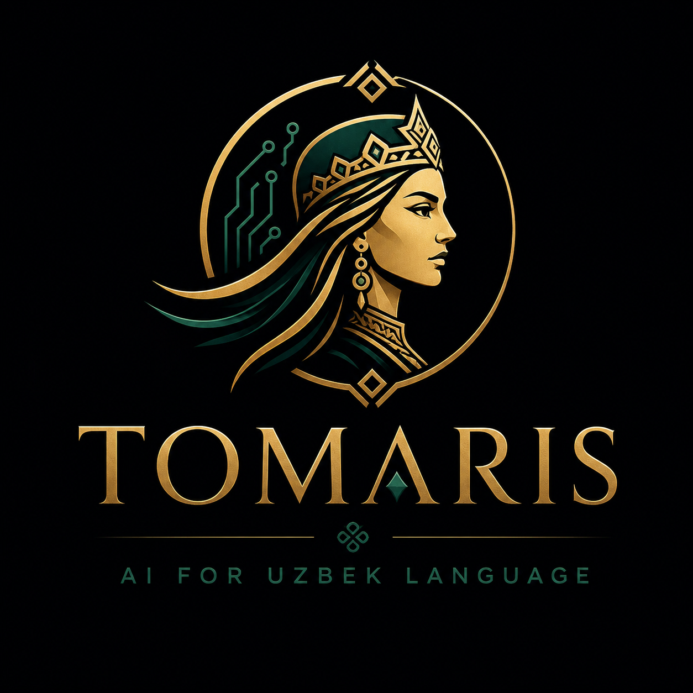

<div align="center">
  <a href="https://tomaris.ai">
    <picture>
      <source media="(prefers-color-scheme: dark)" srcset="public/logo.png">
      
    </picture>
  </a>
  <h1>Tomaris UI</h1>
  <p>The official web platform and chat interface for <a href="https://tomaris.ai">Tomaris AI</a>.</p>
</div>

---

**Tomaris** is a 27B-parameter Large Language Model natively optimized for the Uzbek language, culture, and context. This repository contains the source code for our public-facing marketing site and the interactive chat application.

Live application: **[tomaris.ai](https://tomaris.ai)**

## ✨ Features

- **Native Uzbek Support:** Built from the ground up to understand and generate high-quality Uzbek text, alongside English and Russian.
- **Streaming & Reasoning:** Real-time streaming responses with an exposed reasoning pipeline (Chain of Thought), allowing users to see how the model arrives at its answers.
- **Premium Interface:** A meticulously crafted, dark-first UI built with Tailwind CSS v4 and Framer Motion.
- **Multilingual UI:** Custom i18n support across the entire platform.

## 🏗️ Architecture & Stack

This project is built using a modern Next.js stack, optimized for performance and edge delivery:

- **Framework:** Next.js 16 (App Router) with React 19 and TypeScript.
- **Styling:** Tailwind CSS v4, Base UI primitives, and a custom design system (`DESIGN.md`).
- **Database:** Neon Serverless PostgreSQL with Drizzle ORM.
- **Authentication:** Better Auth.
- **State Management:** Zustand (persisted state for chat history).

## 🧠 Model Backend & Inference

The chat interface proxies requests to an OpenAI-compatible vLLM server (`src/app/api/chat/route.ts`).
- The UI handles both standard text generation and reasoning outputs (`delta.reasoning` / `delta.reasoning_content`).
- Model inference runs on our dedicated GPU cluster.

---

## 💻 Local Development

> [!NOTE]
> You do not need to run this locally to use Tomaris! You can simply visit [tomaris.ai](https://tomaris.ai). These instructions are for developers looking to explore or contribute to the UI codebase.

To run the UI locally, you'll need Node.js installed. Note that without access to our vLLM inference server, the chat will fall back to demo responses.

```bash
# Install dependencies
npm install

# Set up environment variables
cp .env.example .env.local

# Start the development server
npm run dev
```

Open [http://localhost:3000](http://localhost:3000) to view it in the browser. The chat interface is available at `/app`.
