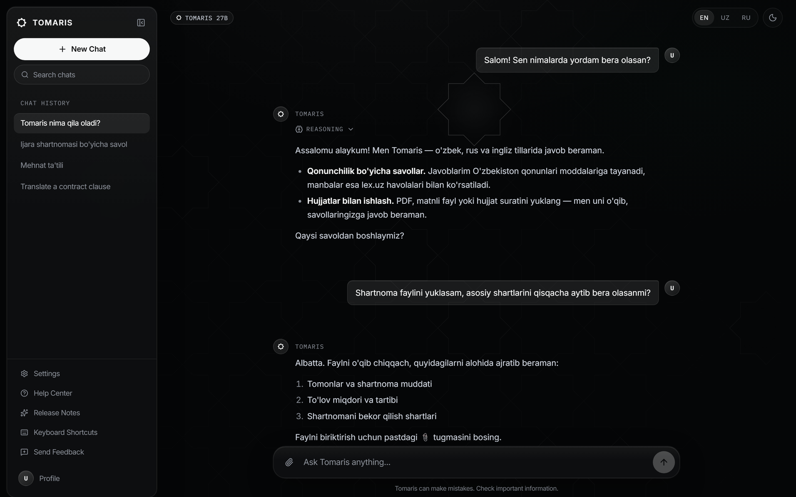
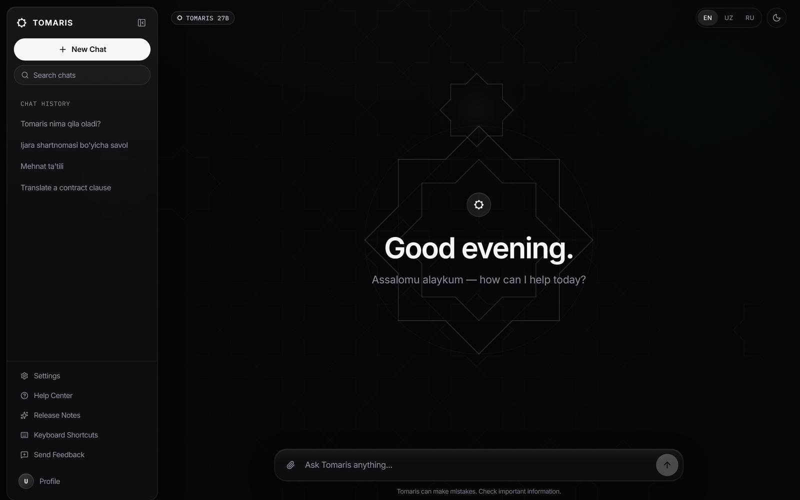
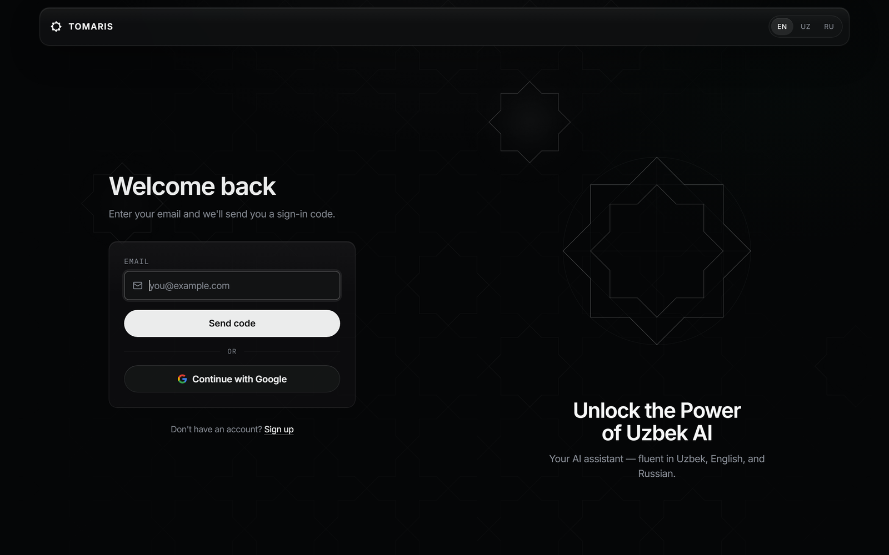
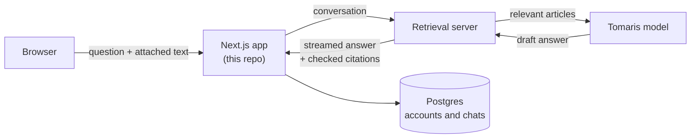

<p align="center">
  <a href="https://tomaris.ai">
    <picture>
      <source media="(prefers-color-scheme: dark)" srcset="public/brand/mark-dark.svg">
      
    </picture>
  </a>
</p>

<h1 align="center">Tomaris</h1>

<p align="center">
  Sovereign AI for Uzbekistan.<br>
  The web app behind <a href="https://chat.tomaris.ai">chat.tomaris.ai</a>.
</p>

<p align="center">
  <a href="https://tomaris.ai">Website</a> ·
  <a href="https://chat.tomaris.ai">Open the chat</a> ·
  <a href="https://tomaris.ai/contact">Book a demo</a>
</p>

<p align="center">
  
</p>

> [!NOTE]
> **The model runs on request.** Anyone can sign up at
> [chat.tomaris.ai](https://chat.tomaris.ai), but the model itself runs on GPUs
> that are switched on for demos. Outside a demo the app loads normally and tells
> you the model is offline. To see it answer live, [book a demo](https://tomaris.ai/contact).

---

## Overview

Tomaris answers in Uzbek, Russian and English. Legal answers are grounded in a
curated corpus of Uzbek statutes, and cited articles link to their source on
[lex.uz](https://lex.uz).

This repository contains the chat application:

- **Chat** with streaming answers, an optional reasoning view, and cited sources
- **Attachments**: PDFs, text and code files, plus OCR for photos of documents
  (Uzbek Latin and Cyrillic, Russian, English), all read in the browser
- **Accounts** with email one-time-code sign-in and optional Google sign-in;
  chat history syncs to the account
- **Workspace tools**: search, rename and export chats, keyboard shortcuts,
  and in-app feedback
- **Three languages**: interface in English, O'zbek and Русский; dark and light themes
- **Admin dashboard** for usage and feedback

<table>
  <tr>
    <td width="50%"></td>
    <td width="50%"></td>
  </tr>
  <tr>
    <td align="center"><sub>Welcome screen</sub></td>
    <td align="center"><sub>Email sign-in</sub></td>
  </tr>
</table>

<sub>Screenshots use sample content.</sub>

## The model

| Spec             | Details                                                      |
| ---------------- | ------------------------------------------------------------ |
| **Name**         | Tomaris 27B                                                  |
| **Size**         | 27 billion parameters                                        |
| **Languages**    | Uzbek, Russian, English                                      |
| **Focus**        | Uzbek law                                                    |
| **Legal corpus** | 7,368 statute articles across 25 codes, cited to lex.uz      |
| **Reasoning**    | Thinks before it answers; the app can show that reasoning    |
| **Access**       | [chat.tomaris.ai](https://chat.tomaris.ai), runs on request  |

### Training data

- **75,000+ lines of human-written Uzbek fine-tuning data**, written by native
  speakers: step-by-step reasoning, translation, refusals and cultural
  knowledge. This is what teaches the model to answer and reason the way a
  native speaker would.
- **Next:** 16,000 digitized Uzbek books are queued for the next training run,
  for longer, more formal text than the web provides.

### Evaluation

Every release has to pass an internal **300-prompt Uzbek benchmark**, written
by people rather than machine-translated, and graded by native speakers. It
has four tracks:

| Track                    | What it checks                                                        |
| ------------------------ | --------------------------------------------------------------------- |
| Fluency and linguistics  | Morphology, vowel harmony, formal vs. spoken register                 |
| Cultural knowledge       | History, literature and everyday context missing from English data    |
| Morphology under pressure| Long suffix chains where one wrong suffix changes the meaning         |
| Math and logic           | 105 Olympiad-grade problems from Uzbekistan Olympiad archives         |

Scores aren't published: grading long-form Uzbek is partly subjective. More in
[Why we built our own Uzbek benchmark](https://chat.tomaris.ai/blog/benchmark-results).

## How it works


```mermaid
flowchart LR
    B["Browser"] -->|"question + attached text"| A["Next.js app<br/>(this repo)"]
    A -->|"conversation"| R["Retrieval server"]
    R -->|"relevant articles"| M["Tomaris model"]
    M -->|"draft answer"| R
    R -->|"streamed answer<br/>+ checked citations"| A
    A --> DB[("Postgres<br/>accounts and chats")]
```

1. **Files stay on your device.** Attachments are read in the browser (pdf.js
   for PDFs, Tesseract for photos); only the extracted text is sent with the
   message.
2. **The app checks who's asking.** `/api/chat` requires a signed-in session,
   rate-limits each user and caps the size of a conversation before forwarding
   it.
3. **Answers come from the statutes.** The retrieval server (a separate
   service, not in this repo) finds the relevant articles, and the model answers
   from them.
4. **Citations are checked, not trusted.** Every article number in the answer
   is checked against the articles that were actually retrieved, so an invented
   citation can't get through. The checked list arrives with the last streamed
   chunk and shows up as source chips linking to lex.uz.
5. **History follows the account.** Only real model output is saved, so failed
   or empty replies never come back on reload.

## Tech stack

| Area      | Choice                                           |
| --------- | ------------------------------------------------ |
| Framework | Next.js 16 (App Router), React 19, TypeScript    |
| Styling   | Tailwind CSS v4, Base UI primitives, Framer Motion |
| Data      | Neon serverless Postgres, Drizzle ORM            |
| Auth      | Better Auth (email OTP, Google OAuth)            |
| Email     | Resend                                           |
| State     | Zustand                                          |
| Inference | OpenAI-compatible streaming API (`/v1/chat/completions`) |

## Getting started

Requires Node.js 20+.

```bash
npm install
cp .env.example .env.local   # then fill in the values
npm run db:push              # create the database tables
npm run dev
```

Open [http://localhost:3000/app](http://localhost:3000/app). Without a model
server configured in `VAST_API_URL`, the chat loads but reports that the model
is unreachable instead of answering.

All environment variables are documented in [`.env.example`](.env.example).

## Scripts

| Command             | Description                        |
| ------------------- | ---------------------------------- |
| `npm run dev`       | Start the dev server               |
| `npm run build`     | Production build                   |
| `npm run start`     | Serve the production build         |
| `npm run lint`      | Lint with ESLint                   |
| `npm test`          | Run unit tests                     |
| `npm run db:push`   | Push the Drizzle schema to the database |
| `npm run db:studio` | Open Drizzle Studio                |

## Project structure

```
src/
  app/
    (app)/          chat, settings and profile (signed-in only)
    (auth)/         login and signup
    (marketing)/    marketing pages
    admin/          admin dashboard
    api/            chat proxy, chat history, auth, feedback
  components/
    chat/           sidebar, composer, messages
    shared/         i18n, theme, dialogs, brand mark
    ui/             primitives
  lib/              auth, database, i18n, file extraction
  stores/           client chat store
```

The visual language (palette, type, components) is described in
[`DESIGN.md`](DESIGN.md).
