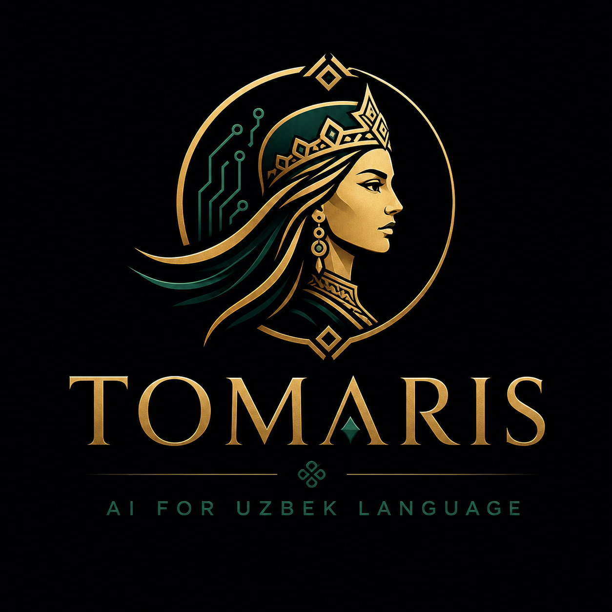

<div align="center">
  <a href="https://tomaris.ai">
    <picture>
      <source media="(prefers-color-scheme: dark)" srcset="public/logo.png">
      
    </picture>
  </a>
  <h1>Tomaris UI</h1>
  <p>The official web platform and chat interface for <a href="https://tomaris.ai">Tomaris AI</a>.</p>
</div>

---

**Tomaris** is a Sovereign AI platform for Uzbekistan. We provide models trained natively on the Uzbek language, a secure support agent that answers only from your approved documents, and a deployment path directly onto your own infrastructure inside the country.

Live application: **[tomaris.ai](https://tomaris.ai)**

## ✨ Features

- **Trained for the language:** Not a translation layer over a model that learned Uzbek by accident.
- **Answers from your documents:** Your team approves the sources. Nothing else is available to it.
- **Deployable inside your borders:** From our infrastructure today to yours, on a path you control.
- **Handoff with context:** When a question needs account access, the agent hands the thread to a named operator and attaches every source it already matched.
- **Operator console:** Every Telegram, web widget, and in-app conversation in one view.

## 🏗️ Architecture & Stack

This project is built using a modern Next.js stack, optimized for performance and edge delivery:

- **Framework:** Next.js 16 (App Router) with React 19 and TypeScript.
- **Styling:** Tailwind CSS v4, Base UI primitives, and a custom design system (`DESIGN.md`).
- **Database:** Neon Serverless PostgreSQL with Drizzle ORM.
- **Authentication:** Better Auth.
- **State Management:** Zustand (persisted state for chat history).

## 🧠 Model Backend & Inference

The chat interface proxies requests to an OpenAI-compatible vLLM server (`src/app/api/chat/route.ts`).
- The UI handles both standard text generation and reasoning outputs (`delta.reasoning` / `delta.reasoning_content`).
- Model inference runs on our dedicated GPU cluster.

---

## 💻 Local Development

> [!NOTE]
> You do not need to run this locally to use Tomaris! You can simply visit [tomaris.ai](https://tomaris.ai). These instructions are for developers looking to explore or contribute to the UI codebase.

To run the UI locally, you'll need Node.js installed. Note that without access to our vLLM inference server, the chat will fall back to demo responses.

```bash
# Install dependencies
npm install

# Set up environment variables
cp .env.example .env.local

# Start the development server
npm run dev
```

Open [http://localhost:3000](http://localhost:3000) to view it in the browser. The chat interface is available at `/app`.
